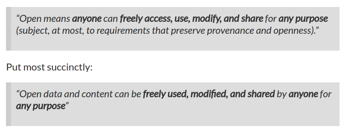
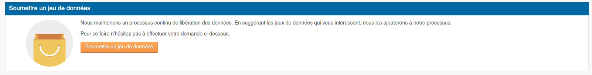
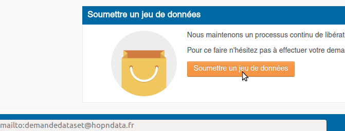
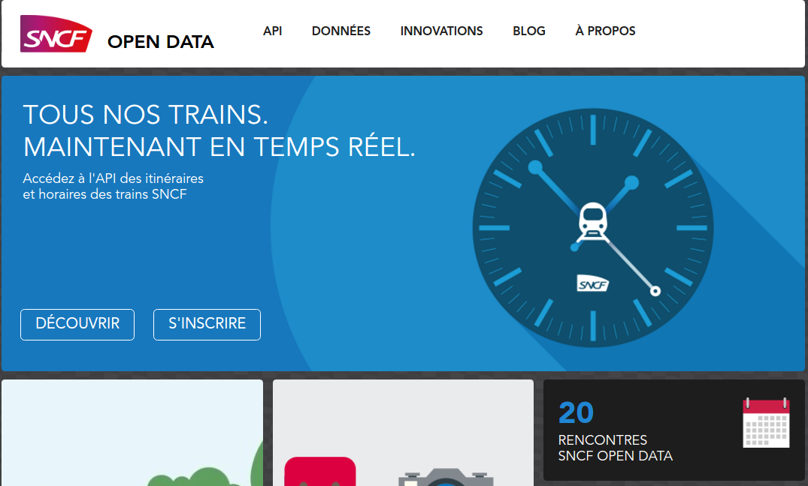
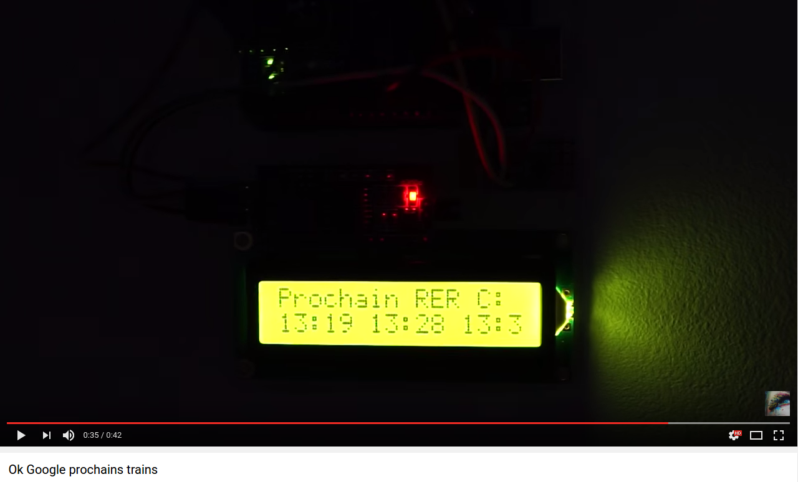
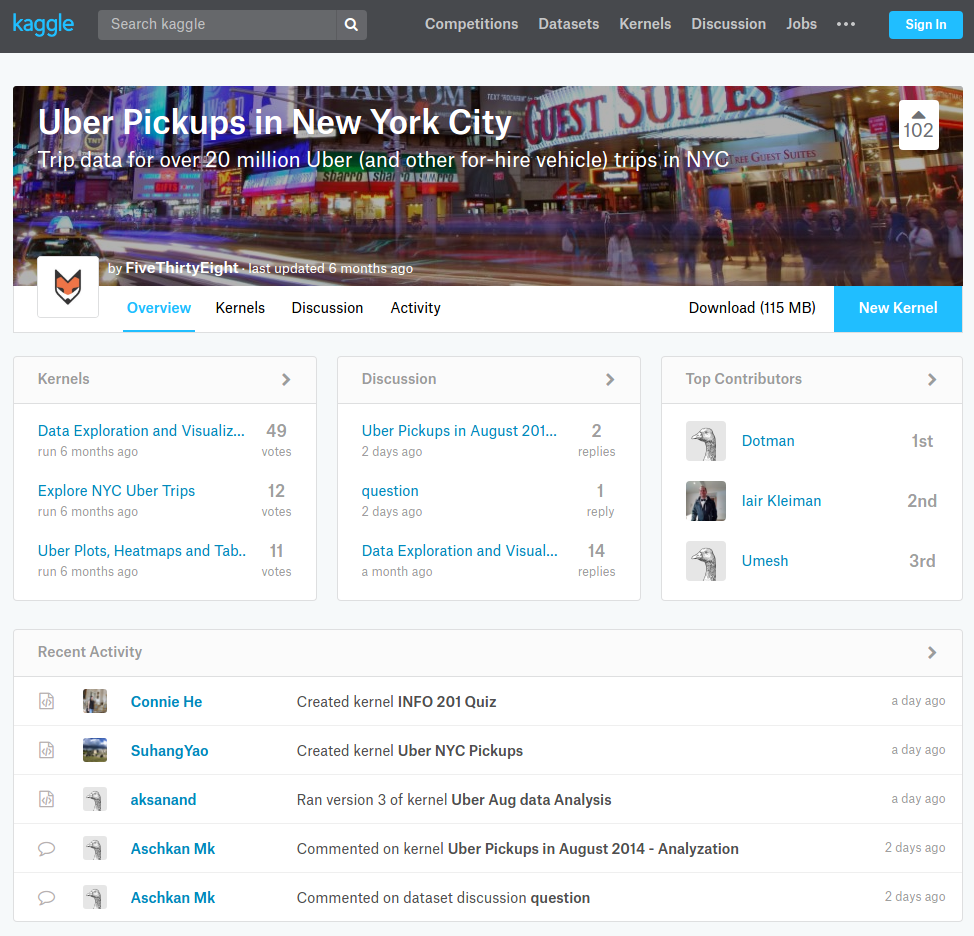
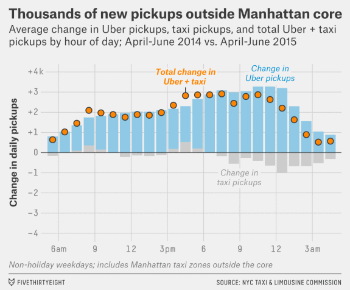
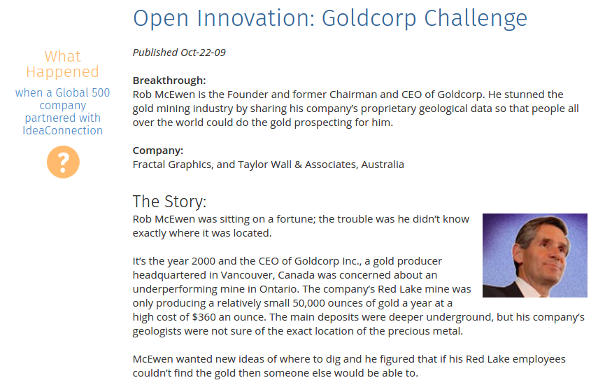
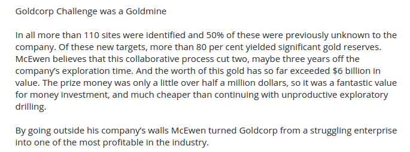

```{r setup, include=FALSE}
options(htmltools.dir.version = FALSE)
knitr::opts_chunk$set(cache = TRUE)
```

class: center, middle, inverse
background-image: url(./img/fog.jpg)
background-position: 50% 50%


# Open data :</BR>pourquoi vous devriezvous y intéresser

</BR>
</BR>
</BR>

### Joël Gombin

</BR>
</BR>
</BR>
</BR>
</BR>

.pull-left[].pull-right[]


---
class: center, inverse, middle

# D'un open data de l'offre<BR>à un open data de la demande

---
class: center, middle
## Mais c'est quoi l'open data ?

???
.center[]

---
class: center, middle
## L'open data de l'offre

---
background-image: url(./img/opendataoffre.png)
background-position: 50% 50%
background-size: cover

???

Inconvénients : 
- données décevantes 
- en qualité (format, granularité, fraîcheur...)
- en quantité
- en impact politique
- etc.

---
background-image: url(./img/ods.png)
background-position: 50% 50%
background-size: cover


???

Il y a aussi des portails plus orientés usagers

---
class: center, middle
## Vers l'open data à la demande 

---
class: middle
.middle[]

???

Site open data de la région Grand Est

---
class: middle
.middle[]

---
## La loi Lemaire 

.center[.reduite[]]

- open data par défaut
- standards ouverts
- mécanisme CADA -> Open Data

---
class: center, middle

## L'important, ce sont les .red[USAGES] !!

???

~ 6 mn

---
class: center, inverse, middle

# Ouvrir ses données

### Pourquoi vos clients vont s'y mettre

### Comment vous pouvez les aider

---
## Quand les entreprises ouvrent leurs données

.center[]

???

usages : citymapper/google maps/trainline etc
mais aussi : afficheur LCD

---
## Quand les entreprises ouvrent leurs données

.center[]


---
## Quand les entreprises ouvrent leurs données

.center[]

???

Obtenue par 538 de l'autorité de régulation des taxis de NYC par une demande FOIL

---
## Quand les entreprises ouvrent leurs données

.center[]

---
## Quand les entreprises ouvrent leurs données

.center[]

???

.center[]

.center[]

---
## L'open data comme communauté

- dans une optique de comm' corporate
- constituer une communauté autour des données
- bâtir de la confiance (ex : rapports RSE)

---
class: center, middle, inverse

# Demain, le web des données

### quelles évolutions ?
### quels enjeux ?
### quels métiers ?

---
## De l'open data au linked data

.center[]

???

Tim Berners-Lee / W3C

---
## Quels enjeux ?

- la data est partout
- elle est au cœur du/des webs
- tous les métiers vont devoir s'y frotter

---
## Quels métiers ?

Ce dont on a besoin : 

- des standards 
- des standards communautaires
- des standards communautaires ouverts
- de l'interopérabilité
- des API

---
## Quels métiers ?

.center[Rings a bell?]

???

W3C, HTML, CSS etc. etc. 

mais attention : AR entre standards et usages, grâce au business

---
class: center, middle, inverse

# Pour conclure :<BR>échangeons, apprenons !

